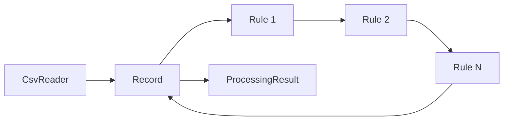

# CSV Pipeline

A Ruby gem that reads CSV records and processes each row through an ordered, configurable pipeline of transformation and validation rules.

The pipeline is independent from individual rules — users add new behaviour by implementing `call(record)` without modifying library code.

Built for the **Consultport Ruby Case Study (2026)**.

## Setup

Requires Ruby **3.0+**. Runtime dependency: stdlib `csv`.

```bash
git clone https://github.com/codestar73/Ruby-library-for-reading-CSV-files.git
cd csv_pipeline
bundle install
bundle exec rspec
bundle exec ruby examples/process_customers.rb
```

## Quick start

```ruby
require "csv_pipeline"

# Recommended: factory with safe rule ordering (validations before optional defaults)
result = CsvPipeline.customer_pipeline.process("examples/customers.csv")

# Or explicit configuration
pipeline = CsvPipeline::Pipeline.new([
  CsvPipeline::NormalizeEmail.new(:email),
  CsvPipeline::Presence.new(:email),
  CsvPipeline::Format.new(:email, CsvPipeline::EMAIL_PATTERN),
  CsvPipeline::DefaultValue.new(:name, "empty")
])

result = pipeline.process("examples/customers.csv")

result.summary
# => { total: 6, valid: 3, invalid: 3, error_count: 3 }

result.valid_hashes
result.invalid_hashes
result.errors_json
result.errors_by_row
```

## Architecture



### 1. CSV Reader (`CsvReader`)

Responsible **only** for:

- Opening and parsing CSV input (file path, IO, or CSV string)
- Treating the first row as headers
- Converting each row into a `Record`
- Preserving the **file line number** for error reporting
- **Streaming** one row at a time via `#each_record` (no full-file load)
- Optional `strict_headers: true` — duplicate headers, blank header names, extra columns, unmapped rows
- UTF-8 BOM stripping and configurable `encoding:` for file sources

```ruby
reader = CsvPipeline::CsvReader.new
reader.each_record("examples/customers.csv") { |record| ... }

# Strict mode for data-quality checks
strict = CsvPipeline::CsvReader.new(strict_headers: true)
```

String sources are resolved in order: existing file path → inline CSV (contains newline/comma) → path-like missing file (`*.csv` or `/`) → otherwise treated as inline CSV body.

Unexpected failures (missing file, malformed CSV) raise library exceptions — they are **not** collected as validation errors.

### 2. Record

Wraps one CSV row:

- Current field values (hash-like access via `record[:field]`)
- Original row number (`record.row`)
- Validation errors collected during processing (`record.errors` returns a **frozen copy**)
- `record.add_error(field, message, code:, value:, rule:)`
- `record.source_data` — original values before transforms
- `record.changed_fields` / `record.changed?` — audit what the pipeline modified
- `record.fresh_copy` — reset to source data for re-processing
- `record.valid?` / `record.invalid?`
- `record.errors_by_field` → `{ email: ["has an invalid format"] }`

A record is mutated as it moves through the pipeline. Errors stay attached, so consumers inspect both final values and all failures.

### 3. Rule interface

Every rule follows one contract:

```ruby
def call(record)
  # transform fields and/or call record.add_error(...)
end
```

The pipeline does not distinguish transforms from validations — it only requires `#call(record)`. Rules are stateless after initialization; configuration (field, default, regex, message) is passed to the constructor.

Inheritance is optional. Duck typing is sufficient and preferred for custom rules.

### 4. Pipeline

Receives an ordered collection of rules and applies **every** rule to **every** record:

```
CSV row → Record → Rule 1 → Rule 2 → Rule N → processed Record
```

- Never stops because of a validation error
- Validation rules append errors; processing continues
- Rule order is intentional (normalize before validate)
- Programming/infrastructure errors propagate as exceptions

The pipeline also accepts an enumerable of records (hashes or `Record` objects), keeping CSV reading separate from rule execution.

Use `#each_processed_record` to process rows lazily. `#process` collects all rows; pass `materialize: false` for a `LazyProcessingResult` on large files.

```ruby
# Lazy — constant memory while iterating
pipeline.process("large.csv", materialize: false).each do |record|
  puts record.error_messages unless record.valid?
end

# Eager — full summary and random access
result = pipeline.process("examples/customers.csv")

# Re-run rules on a clean copy
pipeline.run(record, fresh: true)
```

### Rule-order helpers

```ruby
pipeline = CsvPipeline.build do |p|
  p.required :email do |f|
    f.transform CsvPipeline::NormalizeEmail
    f.validate  CsvPipeline::Presence
    f.validate  CsvPipeline::EmailFormat
  end

  p.optional :name, default: "empty"  # default applied last
end
```

### 5. Processing result (`ProcessingResult`)

Returned by `pipeline.process(source)`:

| Method | Description |
|--------|-------------|
| `valid_records` | Records with no errors |
| `invalid_records` | Records with one or more errors |
| `errors` | Flat list of all `ValidationError` objects |
| `errors_by_row` | Errors grouped by file line number |
| `summary` | `{ total:, valid:, invalid:, error_count: }` |

## Public API

### Array-style configuration (primary)

```ruby
pipeline = CsvPipeline::Pipeline.new([
  CsvPipeline::NormalizeEmail.new(:email),
  CsvPipeline::DefaultValue.new(:name, "empty"),
  CsvPipeline::Presence.new(:email),
  CsvPipeline::Format.new(:email, CsvPipeline::EMAIL_PATTERN)
])
```

### Block DSL (optional convenience)

```ruby
pipeline = CsvPipeline.build do |p|
  p.field :email do |f|
    f.transform CsvPipeline::NormalizeEmail
    f.validate  CsvPipeline::Presence
    f.validate  CsvPipeline::Format, pattern: CsvPipeline::EMAIL_PATTERN
  end
  p.transform :name, CsvPipeline::DefaultValue, default: "empty"
end
```

### Compose pipeline fragments

```ruby
email_rules = CsvPipeline::Pipeline.new([CsvPipeline::NormalizeEmail.new(:email)])
name_rules  = CsvPipeline::Pipeline.new([CsvPipeline::DefaultValue.new(:name, "empty")])

pipeline = email_rules + name_rules
```

## Built-in rules

| Rule | Type | Usage |
|------|------|-------|
| `NormalizeEmail` | Transform | Strip whitespace, downcase; leaves `nil` unchanged |
| `DefaultValue` | Transform | `DefaultValue.new(:name, "empty")` — replaces blank values |
| `Presence` | Validation | Adds error when value is blank |
| `Format` | Validation | `Format.new(:email, pattern, skip_blank: true)` |

**Blank** is defined as: `nil`, `""`, or whitespace-only strings (`CsvPipeline::Blank`).

`Format` skips blank values by default so presence and format do not duplicate errors on the same empty field.

Email pattern: `CsvPipeline::EMAIL_PATTERN`

## Custom rules

Any object responding to `call(record)` works:

```ruby
class CompanyDomainRule
  def call(record)
    email = record[:email]
    return if CsvPipeline::Blank.blank?(email)
    return if email.end_with?("@example.com")

    record.add_error(:email, "must use the company domain", code: :invalid_domain)
  end
end

pipeline = CsvPipeline::Pipeline.new([
  CsvPipeline::NormalizeEmail.new(:email),
  CompanyDomainRule.new
])
```

See `examples/custom_rules.rb` for cross-field validation and domain rules.

This follows the **open/closed principle**: open to extension, closed to modification.

## Error model

Structured `ValidationError` objects (not plain strings):

```ruby
{
  row: 5,
  field: :email,
  code: :invalid_format,
  message: "has an invalid format",
  value: "not-an-email",
  rule: "Format"
}
```

Errors preserve rule execution order for deterministic output.

### Exception types (unexpected failures)

| Exception | When |
|-----------|------|
| `FileNotFoundError` | CSV file path does not exist |
| `ParseError` | Malformed CSV syntax |
| `ConfigurationError` | Invalid rule or pipeline configuration |

Business validation failures are **never** raised — they are collected on the record.

## Sample CSV

`examples/customers.csv`:

| Row | name | email | Result |
|-----|------|-------|--------|
| 2 | Alice | alice@example.com | Valid |
| 3 | Bob | `  BOB@EXAMPLE.COM  ` | Valid → `bob@example.com` |
| 4 | *(blank)* | carol@example.com | Valid → name `"empty"` |
| 5 | David | not-an-email | Invalid → format error |
| 6 | Eve | *(blank)* | Invalid → presence error |
| 7 | *(blank)* | ` INVALID@` | Invalid → name `"empty"`, format error |

Run: `bundle exec ruby examples/process_customers.rb`  
YAML + export demo: `bundle exec ruby examples/yaml_export_demo.rb`

## Advanced features

### Conditional rules

Apply rules only when a predicate matches:

```ruby
pipeline = CsvPipeline.build do |p|
  p.when(->(record) { record[:country] == "US" }) do |w|
    w.validate :zip, CsvPipeline::Presence
  end
end
```

### Cross-field schema definitions

Declare field requirements and cross-field rules in one place:

```ruby
pipeline = CsvPipeline.from_schema do |schema|
  schema.required :email
  schema.normalize_email :email
  schema.format :email, CsvPipeline::EMAIL_PATTERN
  schema.optional :name, default: "empty"
  schema.cross_field(MyCrossFieldRule.new)
end
```

### YAML pipeline configuration

Load pipelines from YAML (`examples/customers.pipeline.yml`):

```ruby
pipeline = CsvPipeline.from_yaml("examples/customers.pipeline.yml")
result = pipeline.process("examples/customers.csv")
```

Conditional YAML rules:

```yaml
rules:
  - type: conditional
    field: zip
    if:
      field: country
      equals: US
    then: presence
```

### JSON and CSV output with errors column

```ruby
result = pipeline.process("examples/customers.csv")

puts result.to_json(pretty: true)
result.write_csv("output.csv", errors_column: "errors")
```

### Fail-fast mode

Stop processing a record after the first validation error:

```ruby
pipeline = CsvPipeline::Pipeline.new(rules, fail_fast: true)
```

### Configurable blank semantics

By default, `nil`, `""`, and whitespace-only strings are blank. Customize globally:

```ruby
CsvPipeline::Blank.configure(treat_nil: true, empty_string: false, whitespace: false)
```

### Internationalized error messages

```ruby
CsvPipeline::Messages.locale = :es
CsvPipeline::Messages.add(:en, :blank, "is required")
```

Built-in locales: `:en`, `:es`. Rules use `Messages.t` for default messages.

## Tests

```bash
bundle exec rspec
```

**90 examples** across:

- **Rule tests** — each rule in isolation with nil/blank/edge cases
- **Pipeline tests** — ordering, multi-error collection, custom rules, composition
- **Feature tests** — conditional rules, schema, YAML, export, fail-fast, i18n
- **CSV reader tests** — headers, line numbers, empty/header-only files, quoted commas, malformed CSV, missing files
- **Integration test** — full `customers.csv` with exact counts and row numbers

## Design decisions

| Decision | Rationale |
|----------|-----------|
| **Composition over inheritance** | `#call(record)` duck typing; optional base classes only for convenience |
| **Separate input from processing** | `CsvReader` creates records; `Pipeline` processes them — reusable with JSON, DB, API |
| **One rule interface** | Transforms and validations share `#call`; simpler orchestration |
| **Collect expected errors, raise unexpected** | Invalid data → record errors; bugs/file failures → exceptions |
| **Ordered rules** | Explicit, predictable; transforms prepare values for validations |
| **Streaming reader** | `#each_record` yields one row at a time; suitable for larger files |
| **Mutable records** | Straightforward API; rule ordering documents side effects |

## Trade-offs

- Records are **mutable** — rule order matters.
- Rules run **sequentially** — parallel execution would be unsafe when transforms affect later validations.
- Email regex validation is **pragmatic**, not RFC-exhaustive.

## Project layout

```
csv_pipeline/
├── lib/
│   ├── csv_pipeline.rb              # Entry point + public API aliases
│   └── csv_pipeline/
│       ├── version.rb
│       ├── exceptions.rb            # FileNotFound, ParseError, ConfigurationError
│       ├── blank.rb                   # Shared blank? semantics
│       ├── blank_policy.rb            # Configurable blank detection
│       ├── messages.rb                # I18n error message catalog
│       ├── patterns.rb                # EMAIL regex constant
│       ├── validation_error.rb        # Structured error value object
│       ├── record.rb                  # Row data, errors, change tracking
│       ├── rule.rb                    # Rule protocol documentation
│       ├── rule_invoker.rb            # Safe field-rule dispatch
│       ├── header_validator.rb        # Strict CSV header/row checks
│       ├── csv_reader.rb              # Streaming CSV ingestion
│       ├── pipeline.rb                # Rule orchestration + DSL
│       ├── field_builder.rb           # Field-scoped DSL helper
│       ├── rules.rb                   # Built-in transform/validation rules
│       ├── rules/conditional.rb       # Conditional rule wrapper
│       ├── conditional_builder.rb     # when(...) DSL helper
│       ├── schema.rb                  # Cross-field schema builder
│       ├── yaml_loader.rb             # YAML pipeline loader
│       ├── exporters.rb               # JSON/CSV result export
│       ├── processing_result.rb       # Eager aggregated output
│       └── lazy_processing_result.rb  # Streaming aggregated output
├── spec/
│   ├── rules_spec.rb                  # Rule unit tests
│   ├── pipeline_spec.rb               # Pipeline, record, result tests
│   ├── csv_reader_spec.rb             # Reader + strict mode tests
│   ├── integration_spec.rb            # End-to-end customers.csv
│   └── features_spec.rb               # Advanced feature tests
├── examples/
│   ├── customers.csv                  # Sample valid/invalid rows
│   ├── customers.pipeline.yml         # YAML pipeline example
│   ├── customer_pipeline.rb           # Canonical pipeline factory
│   ├── process_customers.rb           # Primary demo script
│   ├── yaml_export_demo.rb            # YAML load + JSON/CSV export demo
│   └── custom_rules.rb                # Extensibility demo
├── README.md
├── CHANGELOG.md
├── LICENSE
├── csv_pipeline.gemspec
├── Gemfile
└── Rakefile
```

